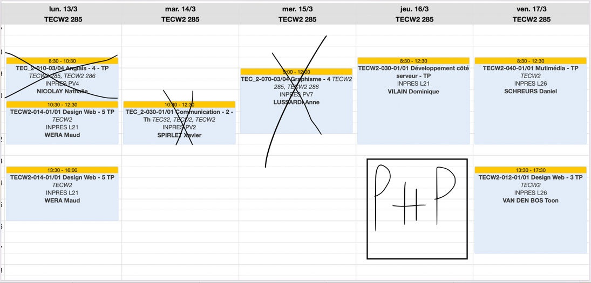

# Rapport du 14 mars 2023 au 17 mars 2023

## notes générales
- Je reprends l'horaire Habituel des rapports.

- Le mardi qui vient de passer j'ai eu des douleurs + ou - forte au niveau de ma plaque (elle m'empêchait de travailler) donc j'ai décidé de juste prendre congé ce jour-là.

- je délaisse pas mal mmi, php et wordpress dans le sens ou je fait que revoir ce qu'on a fait pour mieux suivre le lendemain et les devoirs si j'en ai mais vu que j'ai déjà "vu" la matiere je trouve c'est ok sans compter que le CV faut le finir quoi

- je detaillerai mais journée dans un tableau pour que tu vois mieux mon temps de travail dans le prochain rapport
- Et je passe de 10h de dodo à 8H30/9H

## comment ce passera la stratégie les semaines qui viennent

- vendredi 17 ->  MMI + Wordpress (ecole)
- samedi 18 -> clinclown design (pas école)
- dimanche 19 -> cliniclown design (pas école)
- lundi 20 -> feedback design + on corrige le design (ecole) / on corrige/continue le design (pas école)
- mardi 21  -> design cliniclown et portfolio (pas ecole)
- mercredi 22 -> design cliniclown et portfolio, PHP se remettre à jour pour le cours de demain (pas ecole)
- jeudi 23  -> php (ecole) portfolio cliniclown design
- vendredi 24 -> php (ecole) portfolio cliniclown design
- samedi 25 ->  portfolio clinclown design
- dimanche 26 -> portfolio cliniclown design
- lundi 27 -> design feedback + correction
- mardi 28 -> CV
- mercredi 29 -> MMI PHP WORDPRESS
- jeudi 30 -> ecole + CV 
- vendredi 31 -> ecole + CV
- Samedi 1 -> CV
- Dimanche 2 -> CV

Pour les vacances je sens que je vais faire
- FINIR CV
- FINIR DESIGN CLINICLOWN
- FAIRE LE HTML CSS DU PORTFOLIO
+ Les devoirs MMI PHP

## CV
### Ce que j'ai fait
- le Js
- les animations SVG
- le Css pour écran normal
Mais j'ai pas beaucoup avancé cette semaine sur ça vu que mardi j'était HS
### Ce que je vais faire
- le Js
- les animations SVG
- le Css pour écran normal

### Deadlines
- avoir tout fait (1 avril)
  J'avais mis 13 mars avant parce que je pensais que j'allais faire que ça mais finir le wireframe, design des cliniclowns et de mon portfolio et devenu prioritaire car Mme wera par le 27 mars

## Cliniclowns
### Ce que j'ai fait
- j'ai fini le moodboard, j'ai fait 30% du wireframe
### Ce que je vais faire
- finir le wireframe
- commencer le design du site
### Deadlines
Je me suis surestimé sur finir l'ergolayout ça prends plus de temps
- Design pour le 27 mars (dernier fois je vois Mme Wera)

## Portfolio
### Ce que j'ai fait
rien (priorité CV et cliniclown)
### Ce que je vais faire
rien (priorité CV et cliniclown)
### Deadlines
- Design pour le 27 mars (dernier fois je vois Mme Wera)

## Jeux MMI
### Ce que j'ai fait
- rien
### Ce que je vais faire
- proposer rapidement des jeux à M.Shreurs
    - puissance 4
    - jetpack joyride ?
### Deadlines
dés que je peux (pas encore présenter)

## PHP
### Ce que j'ai fait
- rien
### Ce que je vais faire
- regarder le screencast et en refaire (le mercredi)

d'ailleurs pour rattrapper le retard qu'on a pris avec worldskill et le jour ou il a fait grève il a decidé qu'on aura 8h de cours avec lui les 2 jeudis qui suivent

## MMI
### Ce que j'ai fait
- mes devoirs (resoudre un petit problème mettre à jour la librairie)
### Ce que je vais faire
- je ne sais pas encore
### Deadlines

## web design wordpress
### Ce que j'ai fait
- rien
### Ce que je vais faire
- juste revoir ce qu'on a fait dernirement
### Deadlines

## Stratégie pour du 17 au 24
mettre le CV en suspens pour avoir des feed des design avec mme wera
- Finir le design 2 ou 3 pages cliniclown 
- Finir le design de mon portfolio 
- Le CV quand j'ai envie de chill
- les devoris MMI / PHP la veille

